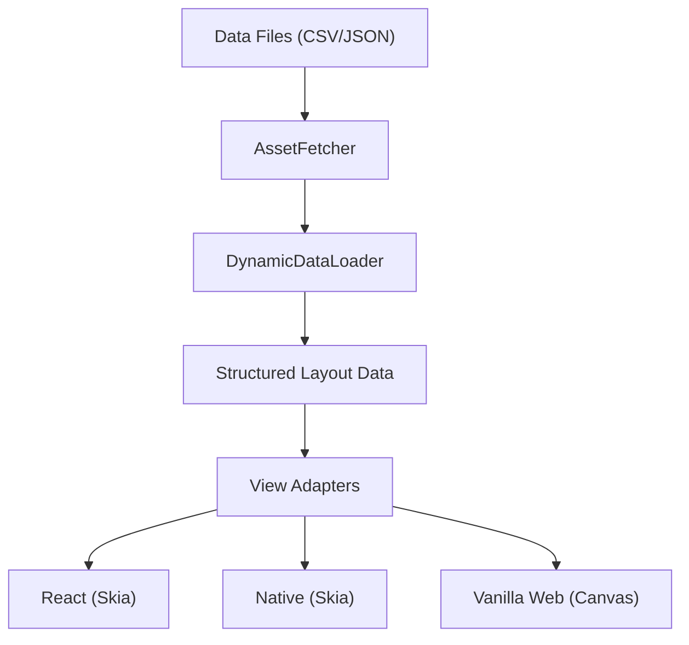

# Architecture Overview

`open-quran-view` follows a modular, decoupled architecture to ensure cross-platform compatibility and framework independence.

## System Design

The library is split into two main layers:

1.  **Core (`src/core`)**: Handles all data fetching, CSV/JSON parsing, and coordinate processing. It is written in pure TypeScript and has no dependencies on rendering libraries.
2.  **View Adapters (`src/view`)**: Framework-specific implementations that consume the Core data and render it.

### Data Flow



## Directory Structure

```text
open-quran-view/
├── src/
│   ├── core/               # Platform-agnostic logic
│   │   ├── types.ts        # Shared interfaces
│   │   ├── fetcher.ts      # Asset loading abstraction
│   │   └── data-loader.ts  # CSV/JSON engine
│   └── view/               # Rendering adapters
│       ├── react/          # Universal React Skia component
│       └── web/            # Vanilla JS Canvas placeholder
├── data/                   # Raw Quranic layout and metadata
├── assets/                 # Page-specific QCF4 fonts
└── docs/                   # Technical documentation
```

## Module Responsibilities

### Core Logic
The `DynamicDataLoader` is the brain of the library. It coordinates the fetching of high-volume layout data (88k+ glyphs) and transforms it into page-specific chunks. It handles:
- **Pagination**: Filtering universal layout data by page number.
- **Grouping**: Organizing glyphs into the standard 15-line format.
- **Centering**: Detecting which lines require centered justification based on metadata.

### View Adapters
View adapters are responsible for taking the arrays of coordinates and glyph IDs and mapping them to a canvas or screen.
- **Skia Adapter**: Uses the Skia engine for hardware-accelerated text rendering, ensuring consistent look-and-feel across Web and Mobile.
- **Web Adapter**: Planned implementation for rendering to a standard 2D context using HTML5 Canvas.

## Data Source
We utilize the **Quranic Universal Library (QUL)** for all coordinate and font resources. This ensures accuracy and alignment with official Mushaf standards.
- [QUL Architecture](https://github.com/TarteelAI/quranic-universal-library)
